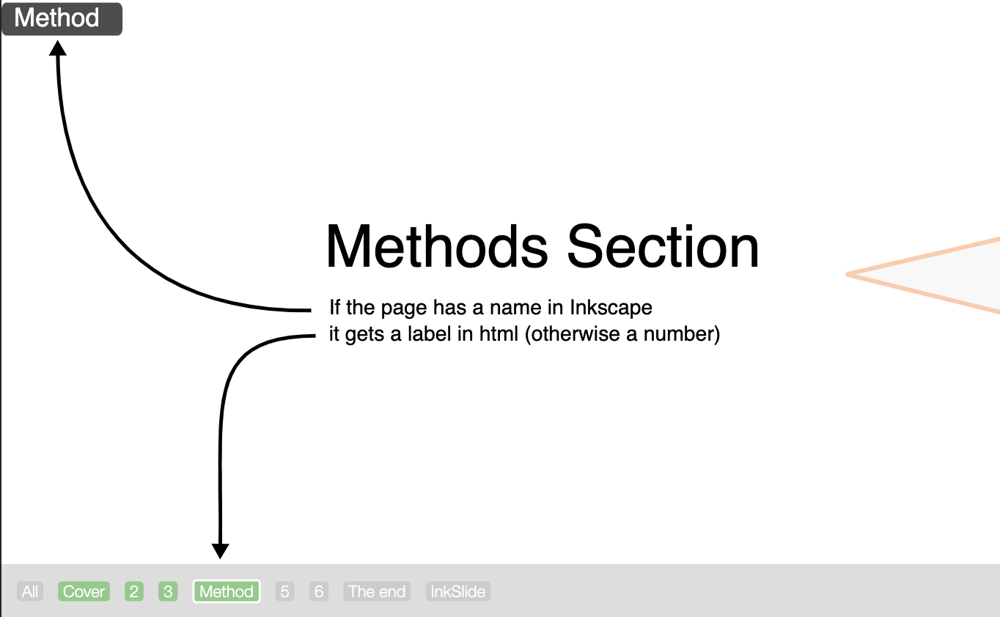

InkSlide
========

Part of my Zero-Microsoft by 2030 pledge.

The latest release of Inkscape includes pages. This opens the door to using Inkscape to create slides for presentations.

This repository contains two key files:

- `slides.svg` - the content of the slides as edited with Inkscape
- `index.html` - the file to open in your browser to present `slides.svg`

Requirements
------------
To present the slides in a browser, they have be located in a folder that can serve the page. On my Mac, for example, the svg content is not accessible if `index.html` is served as a file (security I guess). Try the `Sites` folder, or you may have to do some configuring of your environment (let me know if that is painful and I can include some steps here).

Editing the svg
---------------

Use Inkscape (v 1.2+) to edit `slides.svg`.

**SVG id**: if you create a new file, make sure the `id` for the svg element is set to `svgSlides`. You can do this directly in the XML editor at the very top (`<svg:svg id="svgSlides">`).

**Page order**: Inkscape has a feature to reorder pages, but that is rather clunky. InkSlide therefore reorders them in the order they appear in the Inkscape workspace. Note that if you export your slides as pdf, they will be in the Inkscape order (I hope Inkscape will add a feature 'order pages by position' at some point).

**Animation**: Elements can be shown and hidden on slides. Add a `class` element and give it the value starting with `show1`. Class names have to be sequential (1-10). These will appear after n advances on the slide. Elements with `hide1` (or any number 1-10), disappear that that point. One element can have multiple classes, such as `show2 hide3 show4` to emerge, disappear and come back.

**Navigation**: At the bottom of the slides is a strip with slide names (if the Inscape page was given a name) or the page number. These highlight which slides have been visited (green) and which slide is currently shown (white border). Click on these to jump directly to any slide.

Presenting
----------

Open `index.html` in your browser and switch to full screen. The first slide advance has to be done by clicking anywhere on the slide. 

After that, `<Space>` and `<ArrowRight>` also advance the slides. 

`<ArrowLeft>` goes back.

Jump directly to a slide by clicking on the navigation bar.

`All` brings up and overview of all slides.

